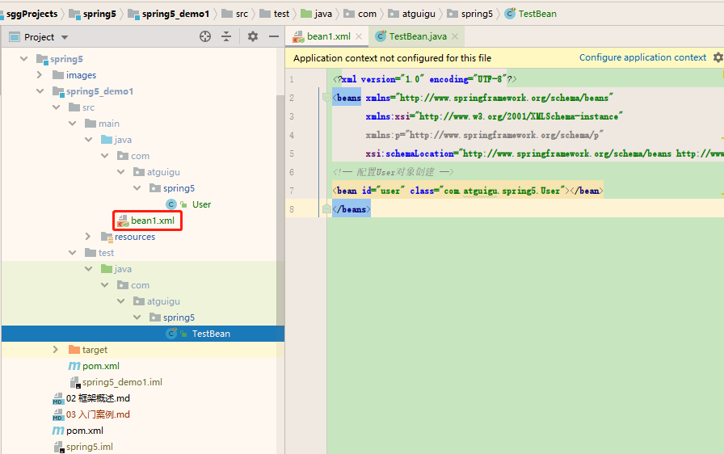

#### Spring5 入门案例

1.创建pom.xml  
下面的spring-context会引入spring的核心模块（bean、core、context、expression）  
```xml
<dependencies>
    <dependency>
        <groupId>org.springframework</groupId>
        <artifactId>spring-context</artifactId>
    </dependency>
</dependencies>
```

另外还要配置下，让src目录下的xml文件能编译到classes目录下  
```xml
<build>
    <resources>
        <resource>
            <directory>src/main/java</directory>
            <includes>
                <include>**/*.xml</include>
            </includes>
        </resource>
        <resource>
            <directory>src/main/resources</directory>
        </resource>
    </resources>
</build>
```
2.创建普通类，在这个类中创建普通方法  
```java
public class User {
    public void add() {
        System.out.println("add......");
    }
}
```
3.创建Spring配置文件，在配置文件中配置要创建的对象  
```xml
<?xml version="1.0" encoding="UTF-8"?>
<beans xmlns="http://www.springframework.org/schema/beans"
       xmlns:xsi="http://www.w3.org/2001/XMLSchema-instance"
       xmlns:p="http://www.springframework.org/schema/p"
       xsi:schemaLocation="http://www.springframework.org/schema/beans http://www.springframework.org/schema/beans/spring-beans.xsd">
    <!-- 配置User对象创建 -->
    <bean id="user" class="com.atguigu.spring5.User"></bean>
</beans>
```

4.编写测试代码  
```java
@Test
public void testAdd() {
    // 1 加载spring配置文件
    ApplicationContext context = new ClassPathXmlApplicationContext("bean1.xml");
    // 2 获取配置创建的对象
    User user = context.getBean("user", User.class);
    System.out.println(user);
    user.add();
}
```
