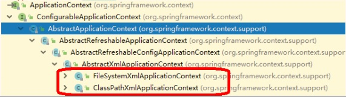

### IOC（BeanFactory接口）
1.IOC思想基于IOC容器完成，IOC容器底层就是对象工厂  
2.Spring提供IOC容器的两种实现：  
（1）BeanFactory：IOC容器基本实现，是Spring内部的使用接口，不提供给开发人员进行使用  
\* 加载配置文件时不会创建对象，在获取对象（使用）才去创建对象  
（2）ApplicationContext：BeanFactory接口的子接口，提供更多更强大的功能，一般由开发人员使用  
\* 加载配置文件时，就会创建对象  
3.ApplicationContext接口有实现类：  
