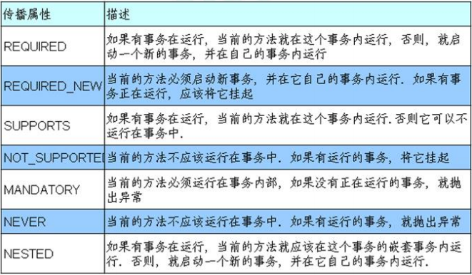
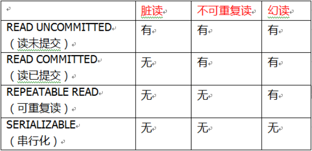

#### 事务操作（Spring声明式事务管理-事务参数）
在service类上添加注解@Transactional，这个注解可以配置以下相关参数  
propagation、isolation、timeout、readOnly、rollbackFor、noRollbackFor  
1.propagation：事务传播行为  
（1）多事务方法之间进行调用，这个过程中事务是如何进行管理的  
```java
public void add() {
    update();
}
public void update() {
}
```
REQUIRED：假设update方法上加了REQUIRED注解，  
如果add方法有事务，调用update方法后，update使用当前add方法里的事务；  
如果add方法没有事务，调用update方法后，会创建新事务  

REQUIRED_NEW：假设update方法上加了REQUIRED_NEW注解，  
无论add方法有无事务，都会创建新的事务  


2.isolation：事务隔离级别  
lsc注：事务隔离级别不是spring特有的，这是数据库本身就有的概念  
（1）事务的隔离性保证多事务操作之间不会产生影响  
（2）不考虑隔离性会产生很多问题：脏读、不可重复读、虚（幻）读  
脏读：一个未提交事务读取到另一个事务未提交事务的数据  
不可重复读：一个未提交事务读取到另一个提交事务修改的数据  
幻读：一个未提交事务读取到另一个提交事务添加的数据  
如何解决以上问题：通过设置事务隔离级别  


3.timeout：超时时间  
（1）事务需要在一定时间内进行提交，如果不提交则会回滚  
（2）默认值是-1，设置时间以秒为单位进行计算  
4.readOnly：是否只读  
（1）读：查询操作；写：增删改操作  
（2）readOnly默认值false，表示可以查询，也能增删改  
（3）设置readOnly是true后，只能进行查询  
5.rollbackFor：回滚  
设置出现哪些异常进行事务回滚  
6.noRollbackFor：不回滚  
设置出现哪些异常不进行事务回滚